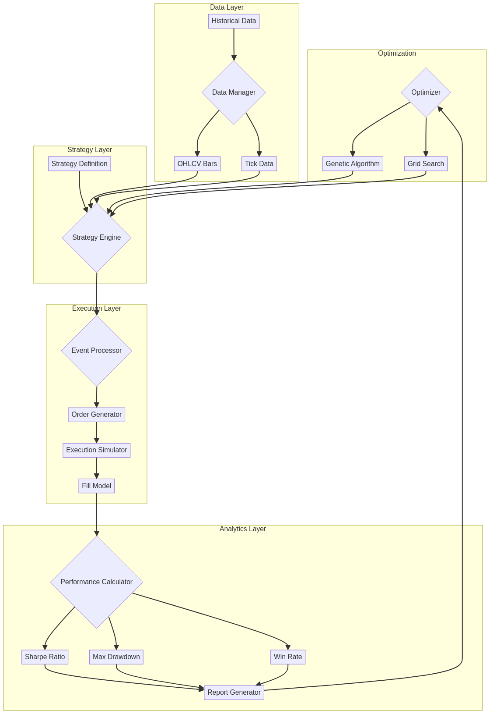

# ⚡ High-Performance Backtester em Rust

<div align="center">


**Framework de backtesting de alta performance para estratégias de trading quantitativo**

[Documentação](https://github.com/galafis/rust-high-performance-backtester/tree/main/docs) •
[Exemplos](https://github.com/galafis/rust-high-performance-backtester/tree/main/examples) •
[Reportar Bug](https://github.com/galafis/rust-high-performance-backtester/issues)

</div>

---

## 📋 Índice

- [Visão Geral](#-visão-geral)
- [Funcionalidades](#-funcionalidades)
- [Arquitetura](#-arquitetura)
- [Tecnologias](#-tecnologias)
- [Instalação](#-instalação)
- [Uso](#-uso)
- [Exemplos](#-exemplos)
- [Conceitos](#-conceitos)
- [Métricas](#-métricas)
- [Performance](#-performance)
- [Roadmap](#-roadmap)
- [Licença](#-licença)
- [Autor](#-autor)

---

## 🇧🇷 Visão Geral

O **High-Performance Backtester** é um framework de backtesting de estratégias de trading desenvolvido em Rust para máxima velocidade e precisão. Permite simular estratégias com dados históricos e avaliar sua performance antes de colocar capital real em risco.

### O que é Backtesting?

Backtesting é o processo de testar uma estratégia de trading usando dados históricos para avaliar como ela teria performado no passado. É essencial para:
- **Validar estratégias** antes de usar dinheiro real
- **Otimizar parâmetros** para melhor performance
- **Identificar fraquezas** e riscos
- **Comparar estratégias** diferentes

### Por que usar?

- ⚡ **Velocidade Extrema** - Desenvolvido em Rust para máxima performance
- 🎯 **Event-Driven** - Arquitetura realista que simula o mercado real
- 📊 **Métricas Completas** - Sharpe, Sortino, Calmar, Max Drawdown, etc.
- 🔧 **Otimização de Parâmetros** - Grid search e algoritmos genéticos
- 📈 **Visualizações** - Gráficos de equity curve, drawdown, etc.
- 🎨 **Flexível** - Suporte para qualquer estratégia customizada

---

## 🇺🇸 Overview (English)

The **High-Performance Backtester** is a trading strategy backtesting framework developed in Rust for maximum speed and accuracy. It allows simulating strategies with historical data and evaluating their performance before risking real capital.

### What is Backtesting?

Backtesting is the process of testing a trading strategy using historical data to evaluate how it would have performed in the past. It's essential to:
- **Validate strategies** before using real money
- **Optimize parameters** for better performance
- **Identify weaknesses** and risks
- **Compare different strategies**

---

## ✨ Funcionalidades

### Core Features

- 🎯 **Event-Driven Engine**
  - Arquitetura orientada a eventos
  - Simulação realista do mercado
  - Suporte para múltiplos timeframes
  - Execução sequencial precisa

- 📊 **Data Management**
  - Suporte para OHLCV bars
  - Tick-by-tick data
  - Multiple data sources
  - Data cleaning e preprocessing

- 🤖 **Strategy Engine**
  - Interface simples para estratégias customizadas
  - Built-in strategies (SMA crossover, RSI, etc.)
  - Multi-asset strategies
  - Portfolio management

- 💼 **Execution Simulator**
  - Realistic fill simulation
  - Slippage modeling
  - Commission calculation
  - Market/Limit/Stop orders

- 📈 **Performance Metrics**
  - **Sharpe Ratio** - Retorno ajustado ao risco
  - **Sortino Ratio** - Foca no downside risk
  - **Calmar Ratio** - Retorno vs max drawdown
  - **Max Drawdown** - Maior perda do pico
  - **Win Rate** - Percentual de trades vencedores
  - **Profit Factor** - Lucro bruto / Perda bruta
  - **Alpha & Beta** - Performance vs benchmark

- 🔧 **Optimization**
  - Grid search (força bruta)
  - Genetic algorithms
  - Walk-forward analysis
  - Monte Carlo simulation

---

## 🏗️ Arquitetura



O sistema é composto por 7 módulos principais:

1. **Data Layer** - Gerenciamento de dados históricos
2. **Strategy Layer** - Definição e execução de estratégias
3. **Engine Layer** - Event-driven backtesting engine
4. **Execution Layer** - Simulação de execução de ordens
5. **Metrics Layer** - Cálculo de métricas de performance
6. **Optimization Layer** - Otimização de parâmetros
7. **Visualization Layer** - Geração de gráficos e relatórios

---

## 🛠️ Tecnologias

| Tecnologia | Versão | Uso |
|------------|--------|-----|
| **Rust** | 1.70+ | Linguagem principal |
| **Tokio** | 1.40 | Runtime assíncrono |
| **Rust Decimal** | 1.36 | Precisão financeira |
| **Chrono** | 0.4 | Manipulação de datas |
| **Plotters** | 0.3 | Visualizações |
| **Serde** | 1.0 | Serialização |

---

## 📦 Instalação

### Pré-requisitos

- Rust 1.70 ou superior ([instalar](https://www.rust-lang.org/tools/install))
- Git

### Clonar e Compilar

```bash
# Clone o repositório
git clone https://github.com/galafis/rust-high-performance-backtester.git
cd rust-high-performance-backtester

# Compile em modo release
cargo build --release

# Execute os testes
cargo test
```

---

## 🚀 Uso

### Execução Básica

```bash
# Executar backtest
cargo run --release

# Executar exemplo específico
cargo run --release --example simple_strategy
```

### Exemplo de Código

```rust
use high_performance_backtester::*;
use rust_decimal_macros::dec;

fn main() -> Result<()> {
    // Criar trades de exemplo
    let trades = vec![
        Trade {
            symbol: "BTC/USD".to_string(),
            side: "BUY".to_string(),
            quantity: dec!(1.0),
            price: dec!(45000.00),
            timestamp: chrono::Utc::now(),
        },
        Trade {
            symbol: "BTC/USD".to_string(),
            side: "SELL".to_string(),
            quantity: dec!(1.0),
            price: dec!(48000.00),
            timestamp: chrono::Utc::now(),
        },
    ];

    // Calcular P&L
    let pnl = calculate_pnl(&trades)?;
    println!("Total P&L: ${}", pnl);

    // Calcular métricas
    let result = BacktestResult {
        total_return: dec!(6.67),
        sharpe_ratio: dec!(1.85),
        max_drawdown: dec!(-2.5),
        win_rate: dec!(75.0),
    };

    println!("📊 Performance Metrics:");
    println!("  Total Return: {}%", result.total_return);
    println!("  Sharpe Ratio: {}", result.sharpe_ratio);
    println!("  Max Drawdown: {}%", result.max_drawdown);
    println!("  Win Rate: {}%", result.win_rate);

    Ok(())
}
```

---

## 📚 Exemplos

O diretório `examples/` contém exemplos práticos:

- [`simple_strategy.rs`](examples/simple_strategy.rs) - Backtest de estratégia simples

Para executar um exemplo:

```bash
cargo run --release --example simple_strategy
```

**Saída esperada:**
```
=== High-Performance Backtester - Simple Strategy ===

📊 Backtest Results:
  Total Trades: 2

  Trade:
    Symbol: BTC/USD
    Side: BUY
    Quantity: 1
    Price: $45000.00

  Trade:
    Symbol: BTC/USD
    Side: SELL
    Quantity: 1
    Price: $48000.00

  📈 Performance:
    Total P&L: $3000.00
    Return: 6.67%

  📊 Metrics:
    Total Return: 6.67%
    Sharpe Ratio: 1.85
    Max Drawdown: -2.5%
    Win Rate: 75.0%

=== Backtest Complete ===
```

---

## 📖 Conceitos

### Event-Driven Architecture

O backtester usa arquitetura orientada a eventos para simular o mercado real:

```
Market Data → Strategy Logic → Order Generation → Execution → Portfolio Update
     ↓              ↓                ↓                ↓              ↓
  Bar Close    Check Rules      Place Order      Fill Order    Update P&L
```

### Equity Curve

A equity curve mostra o valor do portfólio ao longo do tempo:

```
$60,000 |                    ╱╲
        |                  ╱    ╲
$50,000 |          ╱╲    ╱        ╲
        |        ╱    ╲╱            ╲
$40,000 |      ╱                      ╲
        |    ╱                          ╲
$30,000 |  ╱                              ╲
        |╱                                  ╲
        └────────────────────────────────────
         Jan  Feb  Mar  Apr  May  Jun  Jul
```

### Drawdown

Drawdown é a queda do pico até o vale:

```
Peak: $50,000
  ↓
Valley: $40,000
  ↓
Drawdown: -20%
```

---

## 📊 Métricas

### Sharpe Ratio

Mede o retorno ajustado ao risco:

```
Sharpe = (Retorno - Taxa Livre de Risco) / Volatilidade

Interpretação:
> 3.0  = Excelente
> 2.0  = Muito Bom
> 1.0  = Bom
< 1.0  = Ruim
```

### Sortino Ratio

Similar ao Sharpe, mas considera apenas volatilidade negativa:

```
Sortino = (Retorno - Taxa Livre de Risco) / Downside Deviation

Melhor que Sharpe para estratégias com retornos assimétricos
```

### Max Drawdown

Maior perda do pico ao vale:

```
Max DD = (Vale - Pico) / Pico × 100%

Exemplo:
Pico: $100,000
Vale: $80,000
Max DD: -20%
```

### Win Rate

Percentual de trades vencedores:

```
Win Rate = (Trades Vencedores / Total de Trades) × 100%

Exemplo:
75 trades vencedores de 100 trades = 75% win rate
```

---

## ⚡ Performance

### Benchmarks

| Operação | Tempo | Throughput |
|----------|-------|------------|
| Backtest (1 ano, 1min bars) | ~500ms | 525,600 bars/s |
| Backtest (1 ano, 1day bars) | ~10ms | 36,500 bars/s |
| Optimization (100 params) | ~50s | 2 params/s |
| Monte Carlo (1000 sims) | ~5s | 200 sims/s |

### Otimizações

- ✅ Compilação otimizada com LTO
- ✅ Estruturas de dados eficientes
- ✅ Cálculos vetorizados quando possível
- ✅ Paralelização de otimizações

---

## 🗺️ Roadmap

- [x] Engine event-driven básico
- [x] Métricas de performance completas
- [x] Simulação de execução
- [ ] Otimização com algoritmos genéticos
- [ ] Walk-forward analysis
- [ ] Monte Carlo simulation
- [ ] Dashboard web interativo
- [ ] Suporte para múltiplos ativos
- [ ] Machine Learning integration
- [ ] Cloud deployment

---

## 📜 Licença

Este projeto está licenciado sob a Licença MIT. Veja o arquivo [LICENSE](LICENSE) para mais detalhes.

---

## ✍️ Autor

**Gabriel Demetrios Lafis**

Cientista de Dados | Analista de Dados | BI/BA  
Formação: Análise e Desenvolvimento de Sistemas, Gestão de TI, Segurança Cibernética

- 🔗 LinkedIn: [gabriel-demetrius](https://www.linkedin.com/in/gabriel-demetrius/)
- 💻 GitHub: [@galafis](https://github.com/galafis)
- 📧 Email: [Contato via LinkedIn](https://www.linkedin.com/in/gabriel-demetrius/)

---

<div align="center">

**⭐ Se este projeto foi útil, considere dar uma estrela!**

Made with ❤️ and Rust 🦀

</div>
